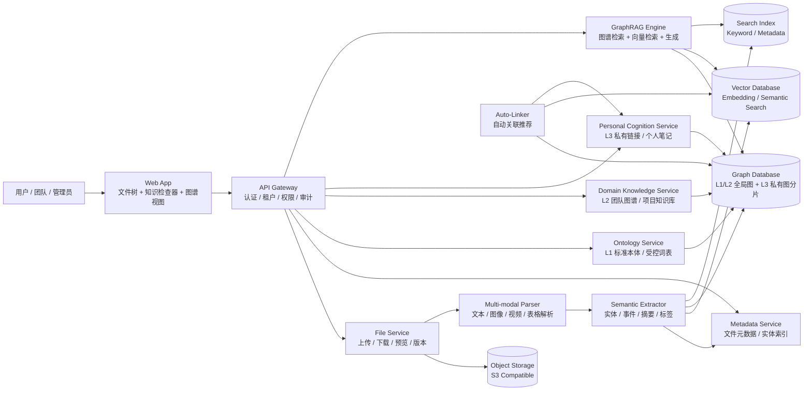
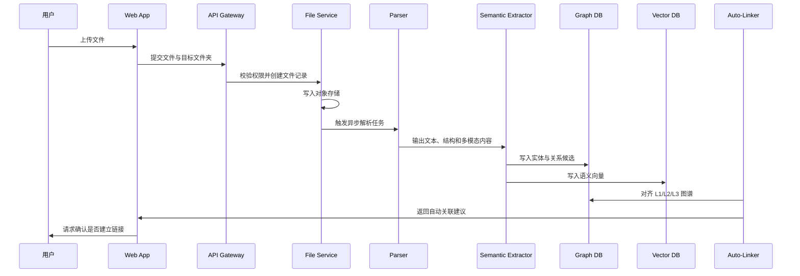
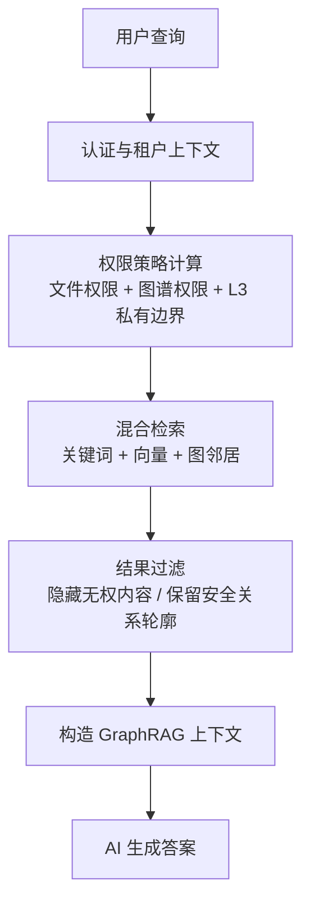

# Knowledge Nexus 核心架构

## 1. 核心命题

Knowledge Nexus 的系统边界可以浓缩为一句话：

> 文件仍由组织管控，知识关系由语义层自由生长。

系统因此被拆成两条互相制衡的主线：

- 物理资产线：负责文件、目录、对象存储、预览、下载、审计和硬权限。
- 语义知识线：负责实体、标签、图谱、向量、双向链接、GraphRAG 和个人认知层。

## 2. 核心组件图

## 3. 三层本体映射

| 层级 | 产品含义 | 技术载体 | 写入方 | 默认可见性 |
| :--- | :--- | :--- | :--- | :--- |
| L1 Standard Ontology | 官方概念、实体类型、分类和模板 | 图数据库中的标准本体子图 | 管理员、领域专家 | 全组织可见 |
| L2 Collective Domain | 团队知识库、项目图谱、部门共识 | 图数据库中的团队/项目子图 | 授权团队成员 | 团队或项目空间可见 |
| L3 Personal Cognition | 私人笔记、双向链接、主观联想 | 用户私有图分片和个人向量索引 | 用户本人 | 仅本人可见 |

## 4. 数据流

## 5. 权限过滤链路

所有 AI 上下文必须遵循先授权、后检索、再生成的顺序。

关键规则：

- 无文件权限时，不能返回文件正文、摘要、预览和敏感元数据。
- 可允许显示“加密节点”，但只能暴露经策略允许的节点类型、关系方向和非敏感关系。
- L3 私有链接不会进入他人的检索上下文。
- AI Agent 不拥有越权能力，只能消费已过滤后的上下文。

## 6. MVP 切片

第一阶段建议先做一个“小而硬”的闭环：

- 文件上传与对象存储抽象。
- 文件元数据表和权限模型。
- AI 自动标签与摘要。
- 个人 `[[Link]]` 双向链接。
- 基础图谱节点与边模型。
- 语义搜索接口。
- 右侧知识检查器原型。

这个切片能证明产品最关键的差异化：文件位置不变，但知识关系可以自由重组。

